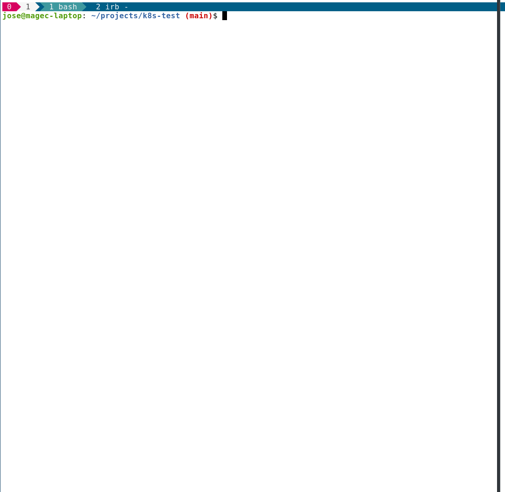

# Kubernetes the not that hard (but kinda) way
An implementation using terraform and puppet of a kubernetes cluster based on https://github.com/kelseyhightower/kubernetes-the-hard-way

## Installation
You just have to have docker installed (also make).

## Execution
The script will create everything needed. You'll need to pass your AWS key pair with admin priviledges.

```
AWS_SECRET_ACCESS_KEY=SECRET AWS_ACCESS_KEY_ID=NO_SECRET ./bin/cli setup
```

This is just a way of testing stuff NO WARRANTY OF ANY KIND. The script is idempotent.

An example

